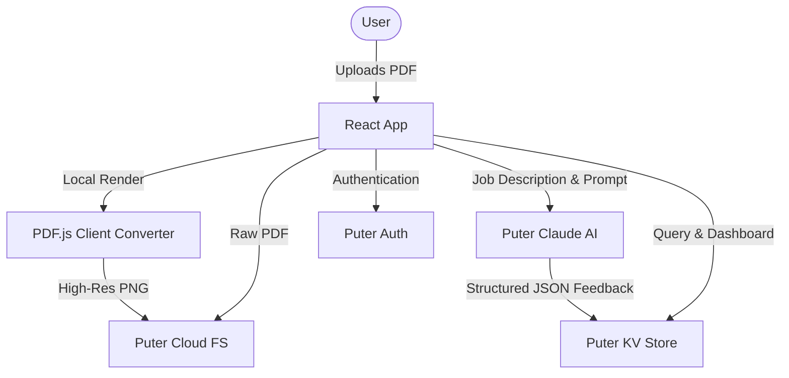

# 📄 Resume Analyzer

An AI-powered, browser-native application designed to analyze resumes, provide actionable optimization advice, and calculate ATS compatibility scores. Tailor your resume for specific job descriptions and get side-by-side feedback in real-time.

Built as a full-stack template on **React Router v7** and powered by the serverless **Puter.js Cloud SDK**, this application requires no traditional database or backend server configuration.

---

## ✨ Features

- **🔒 Passwordless Authentication**: Built-in secure user registration and sign-in powered by Puter Accounts.
- **📄 Client-Side PDF Parsing**: Concurrently processes files locally in the browser. Uses [PDF.js](https://mozilla.github.io/pdf.js/) to convert PDF resumes to high-resolution PNGs for rich browser previews.
- **🤖 Puter AI Integration (Claude 3.5 Sonnet)**: Leverages Puter's AI capabilities to run deep analysis comparing resumes to targeted job descriptions.
- **🎯 Dynamic ATS Scoring**: Calculates ATS-friendly score metrics alongside immediate recommendations to bypass filtering algorithms.
- **📊 Comprehensive Feedback Breakdown**:
  - **Overall Score Gauge**: Interactive radial metrics indicating general resume strength.
  - **Tone & Style Analysis**: Evaluates professional voice, readability, and sentence structure.
  - **Content Quality**: Assesses impact, achievement metrics, and phrasing.
  - **Structural Review**: Validates section styling, readability order, and parsing capability.
  - **Skills Match / Gap Analysis**: Pinpoints required job keywords and technologies missing from the resume.
- **📂 Cloud File System**: Manages uploaded PDFs and rendered preview images using Puter's decentralized Cloud FS.
- **💾 Key-Value Store Persistence**: Stores analysis reports, resume metadata, and configurations in Puter's cloud KV store.
- **💼 Personal Resume Dashboard**: A secure profile area to view all previous resume reviews, track improvements, and manage stored analyses.

---

## 🛠️ Technology Stack

- **Framework**: [React Router v7](https://reactrouter.com/) (Single Page/SSR Template)
- **Styling**: [Tailwind CSS v4](https://tailwindcss.com/) & [lucide-react](https://lucide.github.io/lucide/icons/)
- **State Management**: [Zustand](https://github.com/pmndrs/zustand)
- **PDF Conversion**: [pdfjs-dist](https://www.npmjs.com/package/pdfjs-dist)
- **Backend & Cloud Services**: [Puter.js Cloud SDK](https://puter.com/) (Auth, AI Chat, KV, and FS)

---

## 📐 Architecture & Cloud Integration

This application follows a **serverless, browser-first architecture** leveraging Puter.js as a unified cloud utility provider.



### Puter.js Services Utilized:
1. **`puter.auth`**: Facilitates user authentication state without hosting custom database tables or configuring OAuth credentials.
2. **`puter.fs`**: Uploads, reads, and deletes resume documents and high-resolution page previews.
3. **`puter.ai`**: Evaluates files against complex prompts using `claude-sonnet-4` inside Puter's sandboxed LLM backend.
4. **`puter.kv`**: Persists parsed metadata records (`resume:${uuid}`) mapped to user accounts.

---

## 🚀 Getting Started

### Prerequisites

Ensure you have [Node.js (v20 or newer)](https://nodejs.org/) installed.

### Installation

1. Clone this repository to your local machine:
   ```bash
   git clone https://github.com/AhmeWagih/resume-analyzer.git
   cd resume-analyzer
   ```

2. Install the project dependencies:
   ```bash
   npm install
   ```

### Development

To start the development server with Hot Module Replacement (HMR):

```bash
npm run dev
```

The application will run locally at `http://localhost:5173`. 

> [!NOTE]
> The Puter SDK connects automatically when loaded in the browser. When running on `localhost`, Puter will boot in development mode, linking all file uploads, KV keys, and authentication states securely to your Puter account.

### Building for Production

Create an optimized client-server production build:

```bash
npm run build
```

To run the production build locally:

```bash
npm run start
```

---

## 🐳 Docker Deployment

The project includes a multi-stage `Dockerfile` optimized for minimal footprint and build safety.

### Build the Docker Image
```bash
docker build -t resume-analyzer .
```

### Run the Container
```bash
docker run -p 3000:3000 resume-analyzer
```
The application will be accessible at `http://localhost:3000`.

---

## 📁 Project Structure

```
├── app/
│   ├── components/            # UI components (Gauges, Accordions, File Uploads)
│   │   ├── ATS.tsx            # ATS score rendering & suggestions
│   │   ├── Details.tsx        # Breakdown accordion sections for style, content, etc.
│   │   ├── FileUpload.tsx     # Drag-and-drop file uploader area
│   │   ├── Navbar.tsx         # Universal application navigation bar
│   │   └── Summary.tsx        # Overall score panel and overview
│   ├── routes/                # Application routes
│   │   ├── auth.tsx           # Authentication login/logout page
│   │   ├── home.tsx           # Primary dashboard displaying analyzed resumes
│   │   ├── profile.tsx        # Manage user-specific resumes
│   │   └── resume.tsx         # Main side-by-side analysis report page
│   ├── app.css                # Global stylesheet and Tailwind directives
│   ├── root.tsx               # App layout & Puter SDK injector script
│   └── routes.ts              # Route config definition
├── constants/
│   └── index.ts               # Structured AI prompt template & expected JSON interfaces
├── lib/
│   ├── pdfToImage.ts          # PDF-to-PNG renderer worker utility
│   ├── puter.ts               # Zustand store wrapper for Puter SDK features
│   └── utils.ts               # Helper utilities (UUID generators, clsx merging)
├── types/
│   ├── index.ts               # Shared TypeScript schemas (Job, Resume, Feedback)
│   └── puter.ts               # Puter SDK type definitions
├── Dockerfile                 # Multi-stage production Docker definition
├── package.json               # Application metadata and dependencies
└── vite.config.ts             # Vite bundler configuration
```

---

## 🤝 Contributing

Contributions are welcome! Please follow these guidelines:
1. Fork the repository.
2. Create a new feature branch (`git checkout -b feature/AmazingFeature`).
3. Commit your changes (`git commit -m 'Add some AmazingFeature'`).
4. Push to the branch (`git push origin feature/AmazingFeature`).
5. Open a Pull Request.

---

## 📄 License

Distributed under the MIT License. See `LICENSE` for more information.

Built with ❤️ using React Router and Puter.
